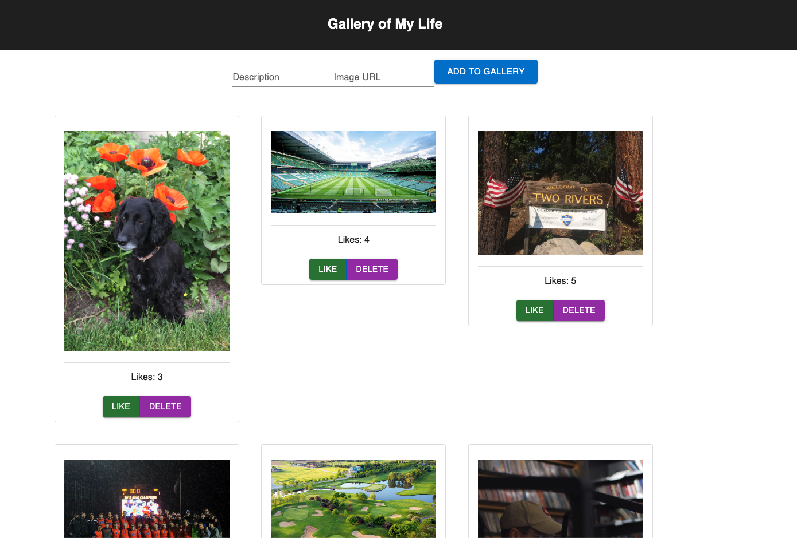

# React Gallery

## Description

_Duration 1 Weekend Sprint_

This Full Stack application uses React to display memories from my life. Users can add another memory, like a memory, and delete a memory (full CRUD).

## Interface

## Installation

([Node.js](https://nodejs.org/en/) is used in this project)

To locally run the project...

1. Create a database named `react_gallery`,
2. The queries in the `database.sql` file are set up to create all the necessary tables and populate those tables with some sample feedack. The project is built on [Postgres](https://www.postgresql.org/download/), so you will need to make sure to have that installed. Using Postico is recommended to run those queries as that was used to create the queries 
3. Open up your code editor of choice and run `npm install` in your terminal to install the necessary dependencies
4. Run `npm run server` in your terminal to start up the server
5. Run `npm run client` in your terminal to start up the client in your browser
6. The `npm run client` command will open up a new browser tab for you! (if not there will be a localhost link in your terminal you can use)

## Built with...

- React
- Express
- Node.js
- PostgreSQL
- Material-UI

## Acknowledgement

Thanks to [Prime Digital Academy](www.primeacademy.io)!

